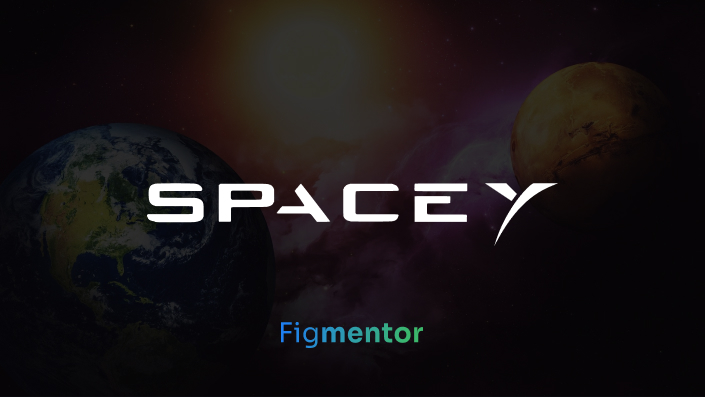
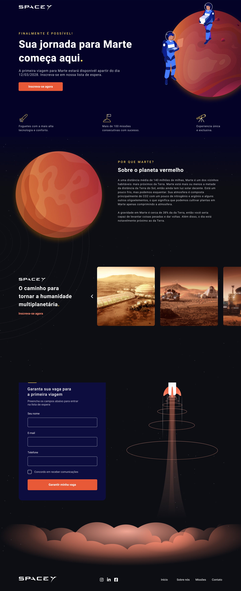

<p align="center">
  
</p>

# Desktop

<h1 align="center">
    
</h1>

<br>

# Mobile

<h1 align="center">
    
</h1>

<br>

## Tecnologias

Esse projeto foi desenvolvido com as seguintes tecnologias:

- [ReactJS](https://reactjs.org/)
- [Styled Components](https://styled-components.com/)

## Para começar

### Pré-requisitos

Editor de codigo <br>
Navegador <br>
NodeJs

<p align="center">
  <strong>Recomendado:</strong>
</p>

```
Visual Studio Code
Chrome
NodeJs

```

### Instalação

<p align="center">
  Instalação do projeto
 </p>

```
1. Abra o terminal do visual studio code;
2. Digite 'git clone https://github.com/Alexsandro-ms/TaskJavaScript.git';
3. Apos acabar o download, abra a pasta no visual studio code.;
4. Digite 'npm install' no terminal para instalar as dependêcias.
5. Em seguida digite 'npm start' para iniciar o projeto.

```

## 🔖 Layout

Você pode visualizar o projeto através dos links abaixo ou na pasta .github

- [Figma](https://www.figma.com/community/file/986447430009792279/duplicate)

Lembrando que você precisa ter uma conta [Figma](http://figma.com/) para acessá-lo.

## 📝 License

Este projeto está licenciado sob a Licença MIT. Consulte o arquivo [LICENSE](LICENSE) para obter detalhes.

---

Código por: [Alexsandro Martins](https://github.com/Alexsandro-ms).
